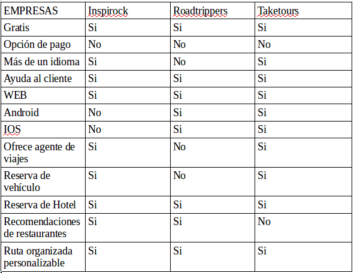
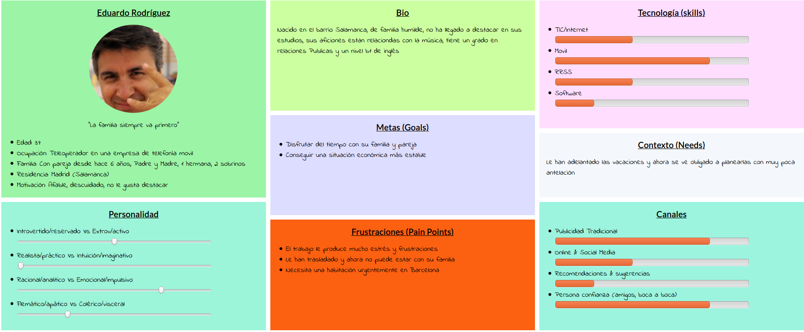
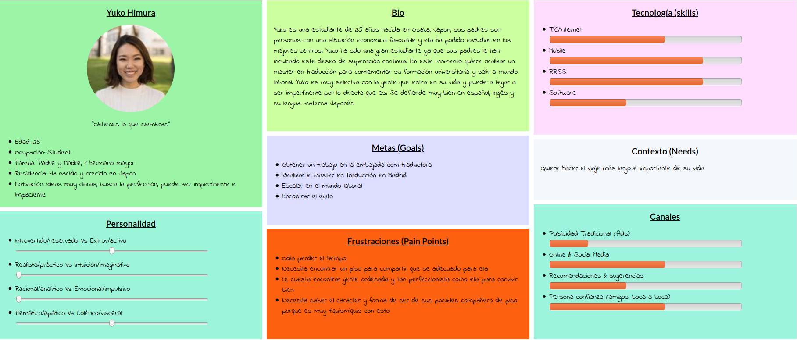

## DIU - Practica 1.

- Tabla de análisis competitivo:

- 2 Personas

Eduardo Rodríguez: Supone el problema de una interfaz no sea muy intuitiva y esto le provoque no encontrar la mejor opción.

Yuko Himura: Representa una persona muy quisquillosa la cual busca una cosa muy específica y no se conforma con cualquier cosa.

