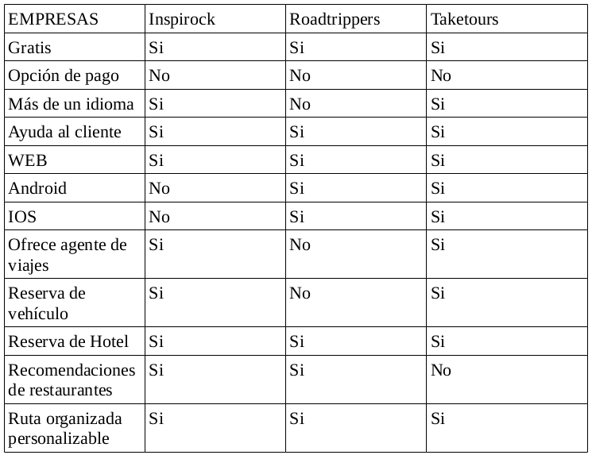
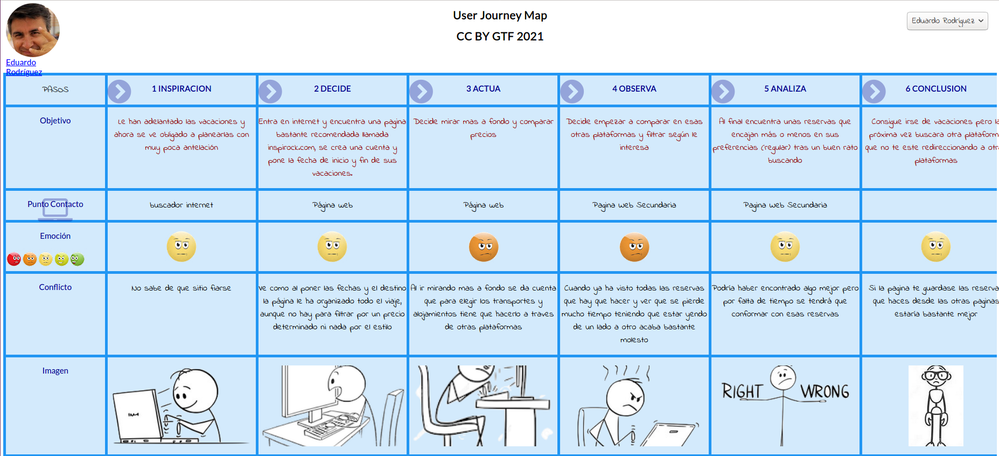
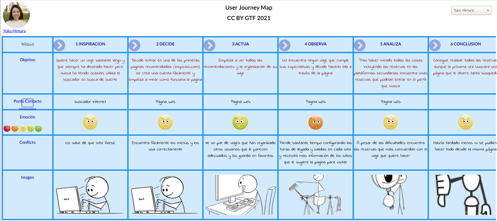

## DIU - Practica 1.

- Tabla de análisis competitivo:
Son páginas que ofrecen servicios tanto para organizar la visita a lugares, también el buscar alojamiento. Suelen tener un diseño sencillo y agradable a la vista en la que tiene todas las opciones para tu viaje. 
He elegido inspirock.com porque creo que es la más completa y con mejor diseño en general.

- 2 Personas

Eduardo Rodríguez: Supone el problema de una interfaz no sea muy intuitiva y esto le provoque no encontrar la mejor opción.

Yuko Himura: Representa una persona muy quisquillosa la cual busca una cosa muy específica y no se conforma con cualquier cosa.

- 2 User Journey Map

- Usability Review
(Completar)
