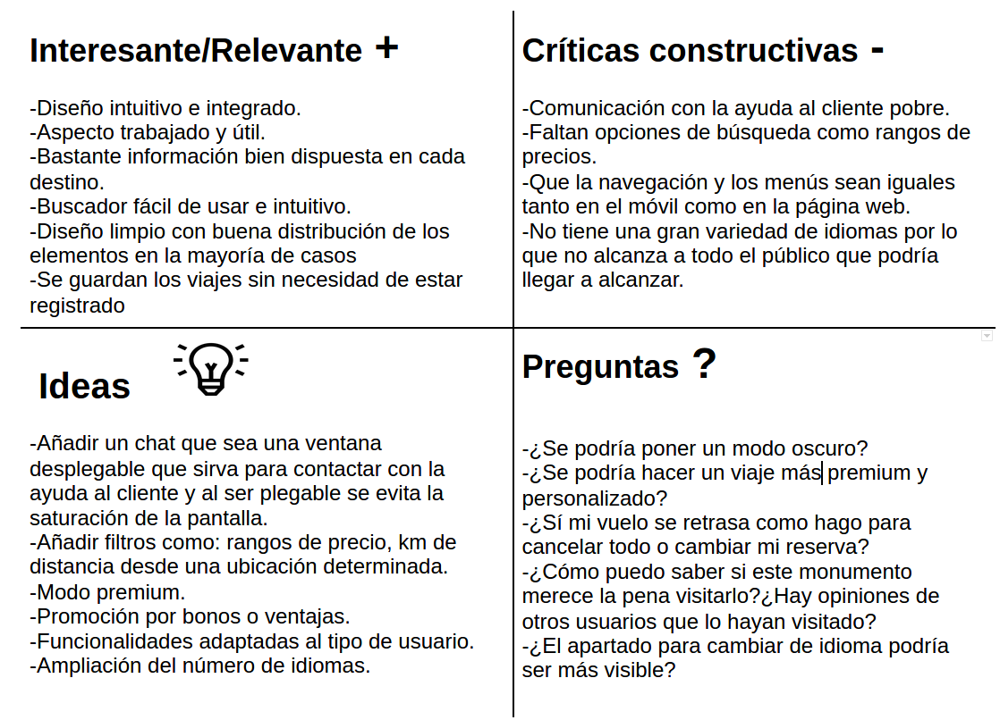

## DIU - Práctica 2.

- Feedback Capture Grid: Malla receptora de Información.

>> Una vez realizadas las entrevistas, habiendo realizado la revisión de usabilidad y añadiendo mi propio enfoque, he clasificado los aciertos y errores de la plataforma.

- Descripción del proyecto

La página web a desarrollar trata de una plataforma que permite la organización de viajes. La plataforma organizará un viaje con todo lo necesario ya sea lugares a los que visitar cada día, alojamiento e incluso posibles sitios a los que ir a comer. La página ofrecerá promociones de viajes a un coste más bajo incentivando así que el usuario seleccione ese viaje. También habrá un modo premium el cual le ofrecerá un mayor número de promociones y algunas más buenas. Luego tendrá varios tipos de búsquedas que se pueden complementar las unas con las otras si se desea. 

Las ideas que quiero implementar:

    -Un modo premium que te libre de ciertos pagos y acceso a contenido exclusivo
    -Un modo oscuro
    -Implementación de bonos o promociones para los usuarios.
    -Una gran variedad de busquedas para que el usuario pueda filtrar los viajes a su gusto.

